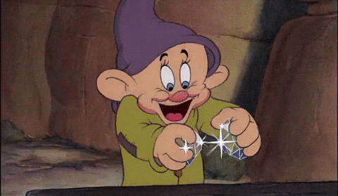

# Data Analytics 1120 Project M2

In this project we are challenged to build a dashboard using Tableau to visualize information of a dataset about diamonds and their quantitative and qualitative features.

This dashboard will show us an in-depth analysis of a dataset about diamonds in order to know which are the best factors to buy a diamond for any reason.

# **Technology used:**
Tableau, Python, Pandas, Plotly.

# **Dashboard:**
https://public.tableau.com/profile/luis.munoz6982#!/vizhome/Versionok1/Dashboardtoshow
 

## **References:**

- [Visual Analysis Best Practices](https://github.com/potacho/ih_datamadpt1120_project_m2/blob/master/images/visual-analysis-guidebook.pdf)

- [Financial Times Visual Vocabulary](https://github.com/ft-interactive/chart-doctor/tree/master/visual-vocabulary)

- [Matplotlib](https://matplotlib.org/)

- [Pandas Visualization](https://pandas.pydata.org/pandas-docs/stable/user_guide/visualization.html)

- [Seaborn](https://seaborn.pydata.org/)

- [Introducing plotly express](https://medium.com/plotly/introducing-plotly-express-808df010143d)

- [Tableau Public](https://public.tableau.com/)

- [Tableau Viz of the Day](https://public.tableau.com/es-es/gallery/?tab=viz-of-the-day&type=viz-of-the-day)

- [Statistical functions (scipy.stats)](https://docs.scipy.org/doc/scipy/reference/stats.html)

- [Two-sample one-tailed t-test with Scipy](https://stackoverflow.com/questions/15984221/how-to-perform-two-sample-one-tailed-t-test-with-numpy-scipy)
